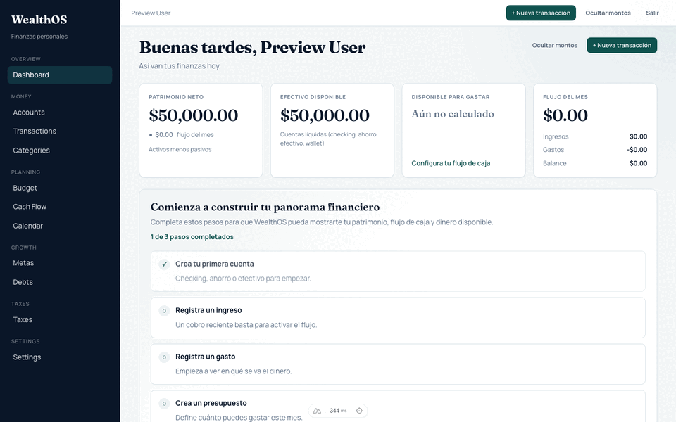
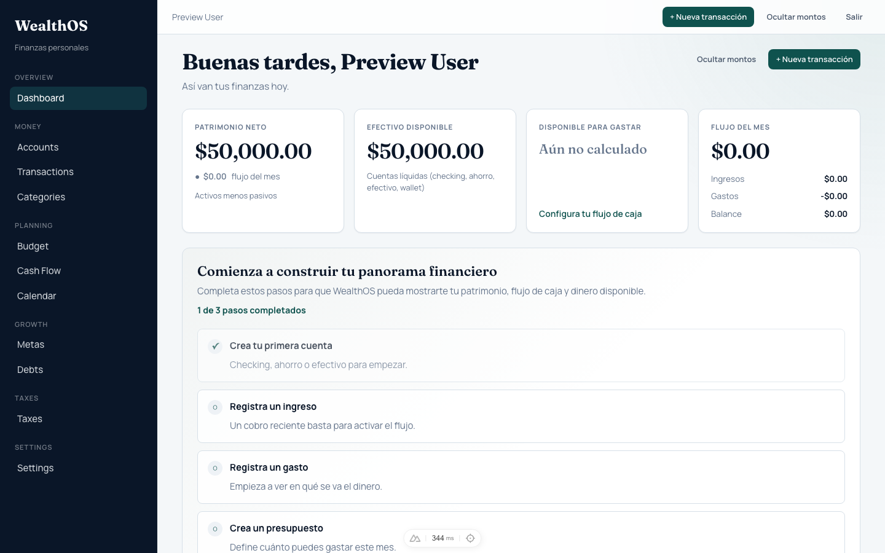
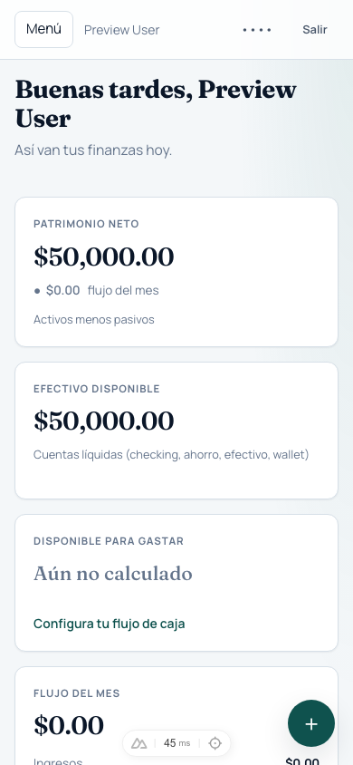
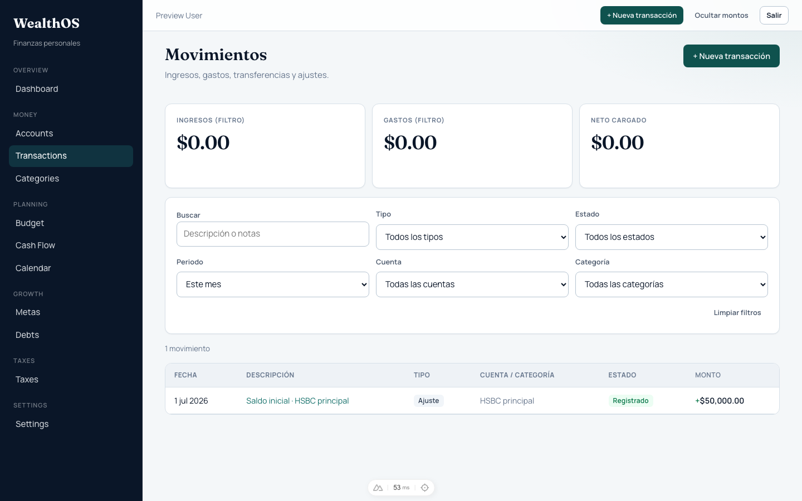
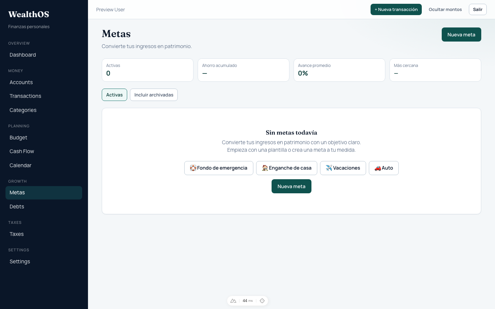

# WealthOS

[](./LICENSE)
[](./backend)
[](./backend)
[](./frontend)
[](./frontend)
[](./frontend)
[](./docker-compose.yml)
[](./docs/adr/ADR-003-open-core.md)
[](#project-status)

> The Financial Operating System for Independent Professionals.

## Preview



### Dashboard



### Dashboard · Mobile



### Transactions



### Goals



---

WealthOS is **not** an expense tracker.

It is a financial operating system designed to help independent professionals build wealth — with clarity over balances, goals, taxes, debt, and long-term decisions.

> [!IMPORTANT]
> WealthOS is under active development and is **not yet recommended for storing production financial data.**

---

## Built for

- Freelancers
- Consultants
- Software developers
- Designers
- Architects
- Lawyers
- Small business owners
- Independent professionals who treat money as a system, not a spreadsheet

---

## Why?

Most independent professionals earn good money...

But very few understand:

- where it goes
- how much they actually own
- whether they're getting closer to buying a home
- how much they should reserve for taxes
- whether today's decisions are hurting tomorrow

WealthOS exists to solve that problem.

---

## Core Features

- Multi-organization financial workspaces
- Financial accounts and real-time balances
- Income, expense, transfer, and adjustment transactions
- Financial categories and hierarchies
- Net-worth and cash-flow dashboard
- Financial goals with account-linked progress
- Multi-currency separation (no silent FX conversion)
- Versioned legal consent and privacy settings
- Responsive desktop and mobile interface

---

## Design Principles

- Financial truth over convenience
- No hidden calculations
- No silent currency conversions
- Explicit financial decisions
- Privacy by design
- Progressive disclosure — show value before complexity

---

## At a glance

| Current MVP | Documentation |
| --- | --- |
| ✓ Authentication & organizations | **12** Architecture Decision Records |
| ✓ Accounts & categories | Product principles and delivery docs in `docs/` |
| ✓ Transactions & dashboard | OpenAPI-typed frontend |
| ✓ Goals & legal consent | Modular monolith · DDD |
| ✓ Responsive UI · demo seed | Tag `v0.5.0-foundation` |
| 🟡 Debts (Sprint 6) | 100% TypeScript frontend · Python backend |

---

## Roadmap

```
✅ Authentication
✅ Organizations & onboarding
✅ Accounts & categories
✅ Transactions
✅ Dashboard
✅ Goals
✅ Legal consent & privacy pages
🟡 Debts / Obligaciones (Financial Commitments)
🟡 Taxes
🟡 Budgets & cash-flow planning
🟡 Recurring transactions
⬜ AI insights
⬜ Advisor / collaboration mode
```

Product language and principles: [`docs/product/`](./docs/product/).
---

## Technology

### Backend

- Python 3.13+
- FastAPI
- PostgreSQL
- SQLAlchemy 2
- Alembic
- Pytest

### Frontend

- Nuxt 3
- Vue 3
- TypeScript
- Pinia
- Vitest / Playwright

### Architecture

```text
┌─────────────────┐
│  Nuxt 3 (Vue)   │  Web app
└────────┬────────┘
         │ HTTPS / JSON
┌────────▼────────┐
│ FastAPI (API)   │  /api/v1
└────────┬────────┘
         │
┌────────▼────────┐
│ Domain modules  │  identity · accounts · transactions ·
│ (modular mono)  │  dashboard · goals · legal · …
└────────┬────────┘
         │
┌────────▼────────┐
│   PostgreSQL    │
└─────────────────┘
```

- Modular monolith
- Domain-driven design
- Repository pattern
- CQRS-inspired read projections (dashboard)
- OpenAPI-generated frontend types

See `docs/` and `docs/adr/` for product and architecture decisions.

---

## Open-Core Model

The core financial platform is open source under the [MIT License](./LICENSE).

Future hosted or commercial capabilities may include:

- Managed cloud hosting
- Advanced tax integrations
- AI-powered financial insights
- Team and advisor collaboration
- Premium reporting and automation

See [ADR-003](./docs/adr/ADR-003-open-core.md).

---

## Project Status

WealthOS is currently in **active development**.

**Foundation milestone:** git tag [`v0.5.0-foundation`](https://github.com/RickGremory/wealthos/releases/tag/v0.5.0-foundation) — navigable core loop live: **accounts → transactions → dashboard → goals**, with legal consent, responsive UI, and a stable demo account.

Still ahead: **debts** (next), taxes, planning UI, recurring transactions, and deeper privacy tooling (ARCO workflows, account deletion).

---

## Current Milestone

**Sprint 6 — Financial Commitments** — Obligaciones at `/app/commitments`.

- **6.1** Product model — [RFC-002](./docs/rfc/RFC-002-financial-commitments.md) ✓  
- **6.2** UX & flows — [sprint-6.2](./docs/roadmap/sprint-6.2-commitments-ux.md) ✓ (*What should I do next?*)  
- **6.3+** API → dashboard widget → Nuxt UI — [sprint brief](./docs/roadmap/sprint-6-financial-commitments.md)

Vocabulary: [PRODUCT_LANGUAGE.md](./docs/product/PRODUCT_LANGUAGE.md) · Principles: [P01–P08](./docs/product/02-product-principles.md).

---

## Local Development

### Requirements

- Docker (Postgres, Redis, Mailpit)
- Python 3.13+ with [uv](https://github.com/astral-sh/uv)
- Node.js 20+ with npm

### 1. Start infrastructure

```bash
cp .env.example .env
docker compose up -d
```

### 2. Backend

```bash
cd backend
cp .env.example .env
uv sync
uv run alembic upgrade head
uv run uvicorn wealthos.main:app --reload --app-dir src --host 0.0.0.0 --port 8000
```

API docs: [http://127.0.0.1:8000/docs](http://127.0.0.1:8000/docs)

### 3. Frontend

```bash
cd frontend
cp .env.example .env
npm install
npm run dev -- --host 127.0.0.1 --port 3000
```

App: [http://127.0.0.1:3000](http://127.0.0.1:3000)

### Demo account

After migrations (or any DB reset), seed the fixed local demo user:

```bash
cd backend
uv run python scripts/seed_demo.py --with-sample-data
# or: make seed-demo
```

| Field | Value |
| --- | --- |
| Email | `demo@wealthos.test` |
| Password | `WealthOS-2026-Segura` |

This command is idempotent: it recreates or restores the password if the user is missing, and optionally ensures a checking account, sample movements, and a goal.

### Useful checks

```bash
# Frontend
cd frontend && npm run lint && npm run typecheck && npm run test

# Backend
cd backend && uv run ruff check . && uv run pytest
```

---

## Repository

```
WealthOS/
├── .github/
├── .ai/
├── docs/              # strategy, ADRs, product principles
│   └── assets/        # README screenshots & product tour
├── specs/             # execution SPECs
├── planning/          # backlog, roadmap, milestones
├── backend/           # FastAPI modular monolith
├── frontend/          # Nuxt 3 application
├── infrastructure/
├── scripts/
├── docker-compose.yml
└── README.md
```

Public legal pages (when running locally): `/legal`, `/legal/privacy`, `/legal/terms`, `/legal/cookies`.

---

## Vision

Become the financial operating system for independent professionals worldwide —
helping them build wealth through clearer financial decisions.
